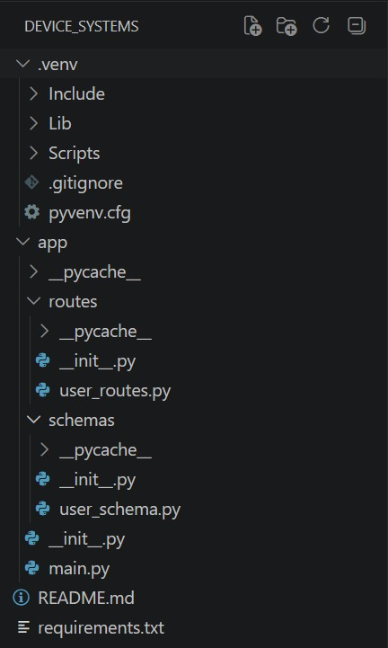
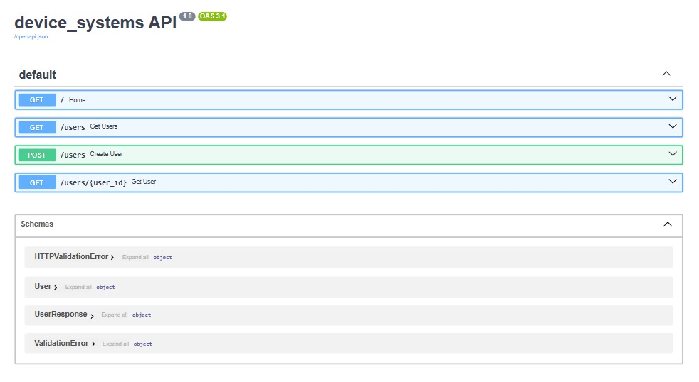
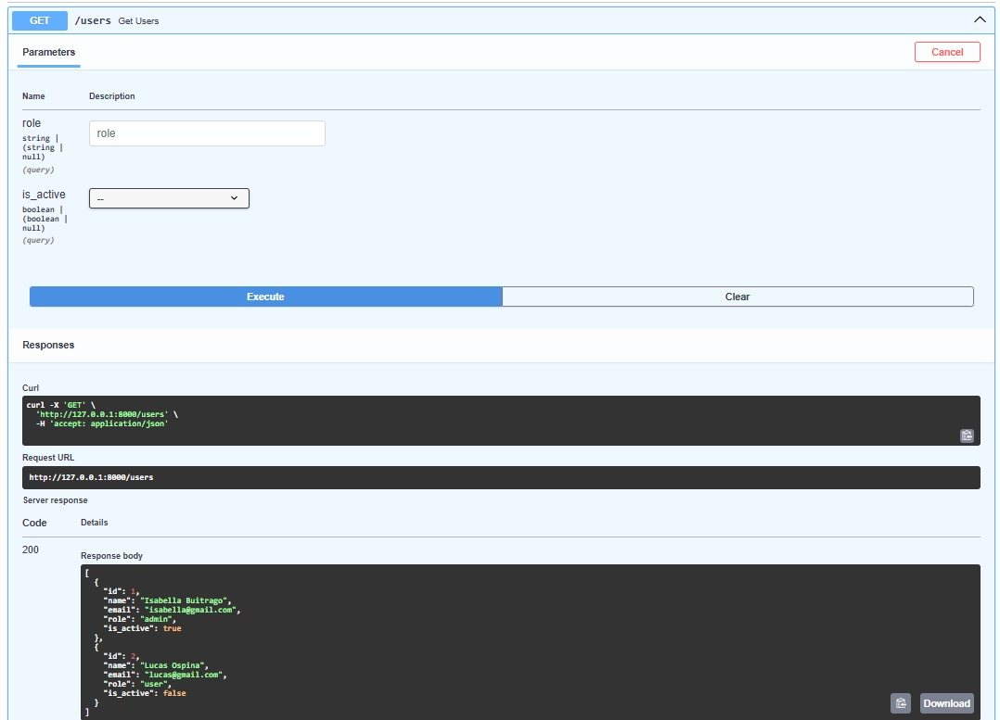
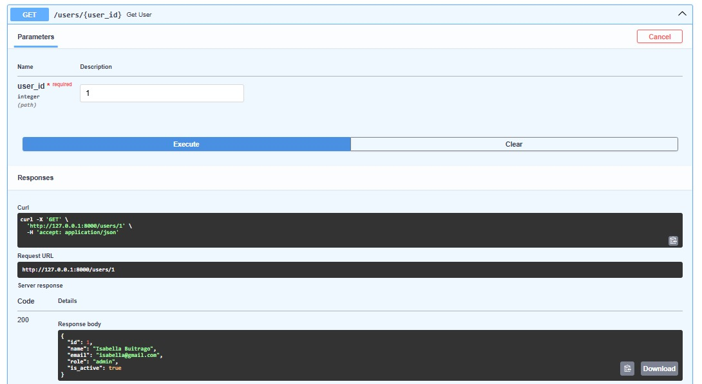
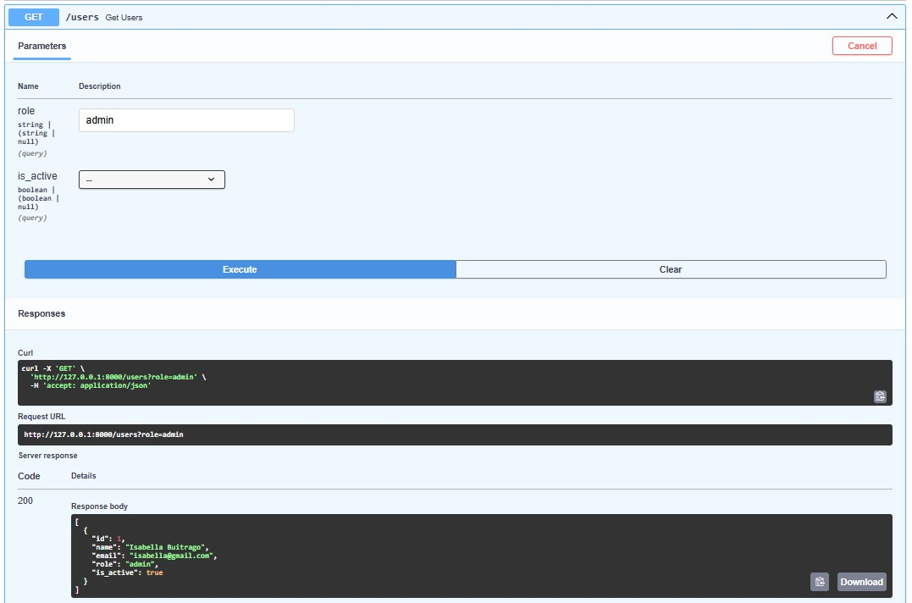
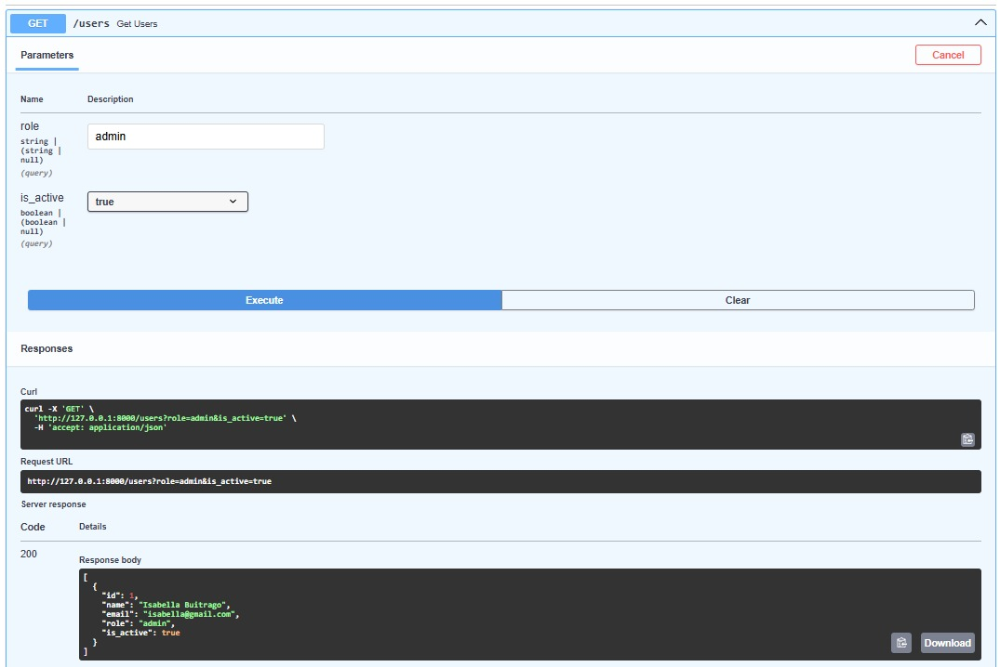

# Device Systems API

## Descripción

Device Systems API es una aplicación backend desarrollada con FastAPI para la gestión de usuarios mediante una API REST.

Este proyecto fue realizado con el propósito de aplicar los conceptos fundamentales de FastAPI, incluyendo validación de datos con Pydantic, uso de métodos HTTP, parámetros de ruta, parámetros de consulta, modelos de respuesta y documentación automática.

La aplicación permite:

* Consultar todos los usuarios registrados.
* Buscar usuarios por identificador.
* Filtrar usuarios por rol.
* Filtrar usuarios por estado activo o inactivo.
* Registrar nuevos usuarios.
* Validar datos mediante Pydantic v2.
* Evitar el registro de correos electrónicos duplicados.
* Implementar cabeceras HTTP personalizadas.

---

## Tecnologías Utilizadas

* Python 3.14
* FastAPI
* Uvicorn
* Pydantic v2
* Swagger UI
* Git
* GitHub

---

## Estructura del Proyecto

```text
device_systems/
│
├── app/
│   ├── __init__.py
│   ├── main.py
│   │
│   ├── routes/
│   │   ├── __init__.py
│   │   └── user_routes.py
│   │
│   └── schemas/
│       ├── __init__.py
│       └── user_schema.py
│
├── requirements.txt
├── README.md
└── .gitignore
```

---

## Instalación

### 1. Clonar el repositorio

```bash
git clone https://github.com/TU-USUARIO/device_systems.git
cd device_systems
```

### 2. Crear entorno virtual

```bash
python -m venv .venv
```

### 3. Activar entorno virtual

Windows:

```bash
.venv\Scripts\activate
```

### 4. Instalar dependencias

```bash
pip install -r requirements.txt
```

---

## Ejecución del Servidor

Ejecutar el siguiente comando:

```bash
uvicorn app.main:app --reload
```

Luego acceder a:

### Swagger UI

```text
http://127.0.0.1:8000/docs
```

### ReDoc

```text
http://127.0.0.1:8000/redoc
```

---

## Endpoints Disponibles

| Método | Endpoint              | Descripción                |
| ------ | --------------------- | -------------------------- |
| GET    | /users                | Obtener todos los usuarios |
| GET    | /users/{user_id}      | Obtener usuario por ID     |
| GET    | /users?role=admin     | Filtrar usuarios por rol   |
| GET    | /users?is_active=true | Filtrar usuarios activos   |
| POST   | /users                | Registrar un nuevo usuario |

---

## Modelo de Usuario

| Campo     | Tipo     | Validación            |
| --------- | -------- | --------------------- |
| id        | integer  | Obligatorio           |
| name      | string   | Mínimo 3 caracteres   |
| email     | EmailStr | Correo válido         |
| role      | string   | admin, support o user |
| is_active | boolean  | true o false          |

---

## Ejemplos de Peticiones

### GET /users

```http
GET /users
```

### Respuesta

```json
[
  {
    "id": 1,
    "name": "Juan Perez",
    "email": "juan@gmail.com",
    "role": "admin",
    "is_active": true
  }
]
```

---

### GET /users/{user_id}

```http
GET /users/1
```

### Respuesta

```json
{
  "id": 1,
  "name": "Juan Perez",
  "email": "juan@gmail.com",
  "role": "admin",
  "is_active": true
}
```

---

### POST /users

### Petición

```json
{
  "id": 5,
  "name": "Andrea",
  "email": "andrea@gmail.com",
  "role": "user",
  "is_active": true
}
```

### Respuesta

```json
{
  "id": 5,
  "name": "Andrea",
  "email": "andrea@gmail.com",
  "role": "user",
  "is_active": true
}
```

---

## Validaciones Implementadas

### Nombre

El nombre debe contener al menos tres caracteres.

Ejemplo inválido:

```json
{
  "name": "Jo"
}
```

---

### Correo Electrónico

Debe tener un formato válido.

Ejemplo inválido:

```json
{
  "email": "correo_invalido"
}
```

---

### Rol

Valores permitidos:

* admin
* support
* user

Ejemplo inválido:

```json
{
  "role": "manager"
}
```

---

### Correo Duplicado

No se permite registrar usuarios con correos ya existentes en el sistema.

Ejemplo de respuesta:

```json
{
  "detail": "El correo ya existe"
}
```

---

## Cabeceras HTTP Personalizadas

Las respuestas de la API incluyen las siguientes cabeceras:

```http
X-App-Name: device_systems
X-API-Version: 1.0
```

---

### Captura 1 - Estructura del Proyecto



### Captura 2 - Swagger UI



### Captura 3 - GET /users



### Captura 4 - GET /users/{user_id}



### Captura 5 - Filtro por Rol



### Captura 6 - Filtro por Estado



### Captura 7 - POST /users


## Reflexión Final

Durante el desarrollo de esta actividad aprendí a construir una API REST utilizando FastAPI y a organizar un proyecto backend de manera modular. La implementación de modelos con Pydantic me permitió comprender la importancia de validar la información recibida para garantizar la integridad de los datos.

Asimismo, pude aplicar conceptos como Path Parameters y Query Parameters para realizar consultas más específicas, además de utilizar Response Models para controlar la información retornada por la API. La documentación automática generada por Swagger UI facilitó las pruebas de cada endpoint y permitió verificar el correcto funcionamiento de la aplicación.

Esta experiencia fortaleció mis conocimientos en el desarrollo de servicios web con Python y me permitió conocer herramientas modernas que simplifican la creación de APIs seguras, organizadas y fáciles de mantener.
